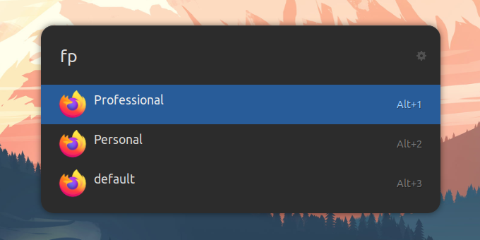

# Ulauncher Firefox Profiles

An [Ulauncher](https://ulauncher.io) extension to open Firefox with an user profile.

> Inspired by [Ulaucher Chrome Profiles Extension](https://github.com/FloydJohn/ulauncher-chrome-profiles)

## Screenshot

## Install

1. Open Ulauncher preferences
2. Enter "Extensions" Tab
3. Click "Add extension" on the left
4. Paste the url: `https://github.com/kleber-swf/ulauncher-firefox-profiles`
5. Press "Add"

## Configuration

-  **Firefox Profiles Keyword**: The keyword to activate the extension. Default: `fp`.

-  **Firefox Configuration Folder**: Firefox profiles folder. You can find it inside the _"about:profiles"_ page. Default: `~/snap/firefox/common/.mozilla/firefox/`

-  **Firefox Executable**: The command line to start Firefox. Usually _"firefox"_. Default `firefox`.

---

Preview Theme: [Orchis Dark](https://github.com/kleber-swf/orchis-dark-ulauncher)
